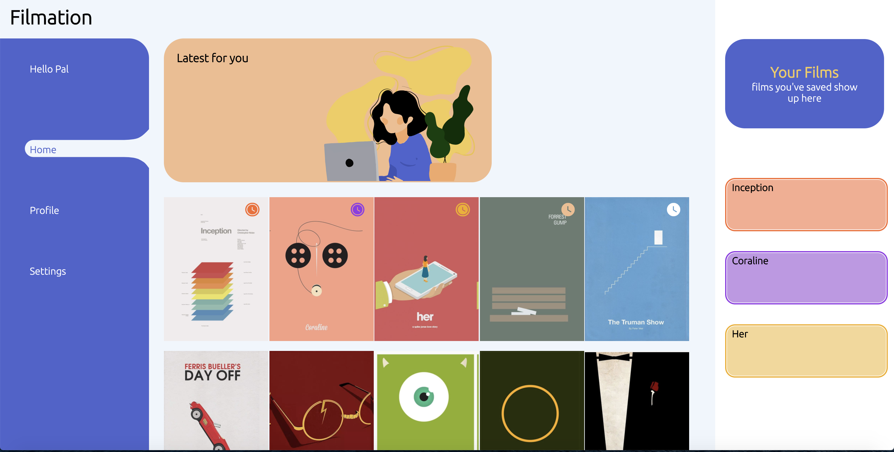
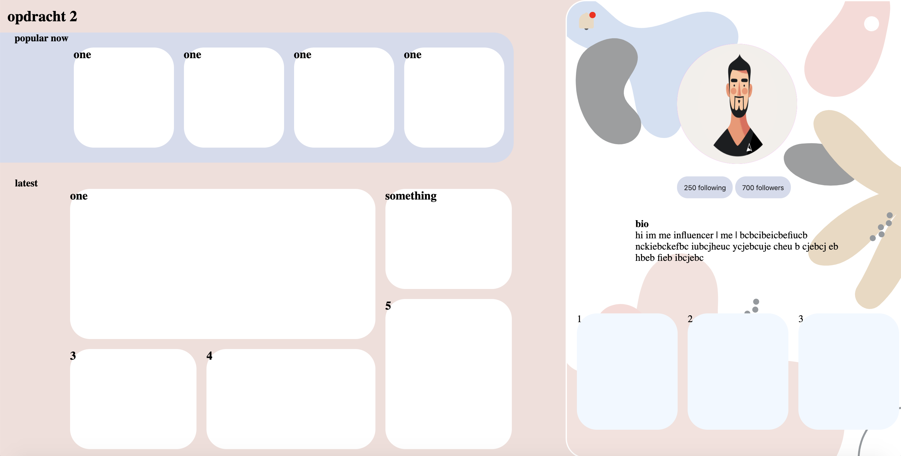
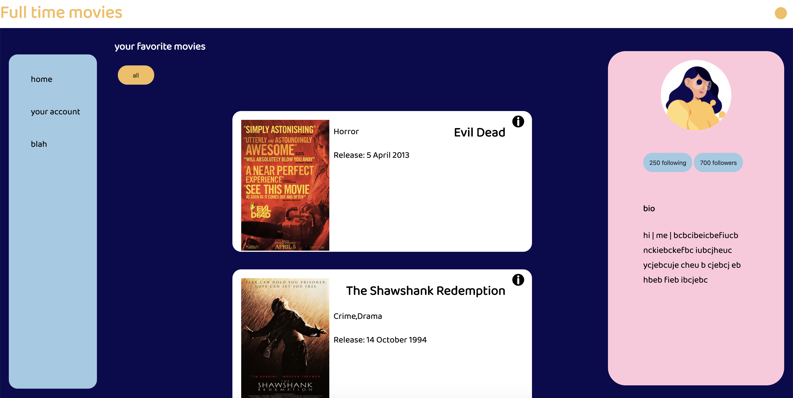

mijn 3 Fvd opdrachten:

1. [Opdracht 1: Een Micro-interactie uitwerken en testen](opdracht1/)

2. [Opdracht 2: Een interactie uitwerken voor verschillende gebruikers input](opdracht2/)

3. [Opdracht 3: Een interactie uitwerken met externe data](opdracht3/)

---
- [Markup cheat sheet](https://github.com/adam-p/markdown-here/wiki/Markdown-Cheatsheet)
- [Getting started with GitHub Pages](https://guides.github.com/features/pages/)
